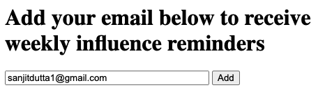
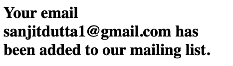
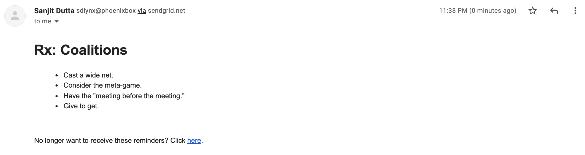
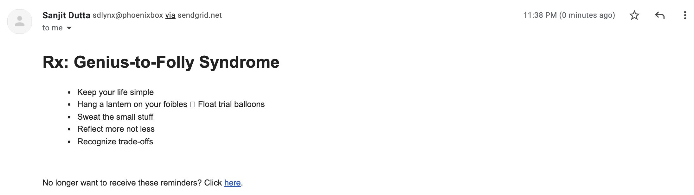
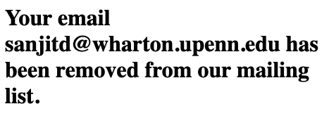

# influence-reminders

This tool sends anyone who signs up an email every Monday morning with a reminder
of one of the influence prescriptions taught in Wharton's OIDD 693 course.

## Installation

Clone this repository, add the cron sample (adjusted to your file location) to
your crontab and ensure your `mail` command works. You'll also need the `jq` tool.
You can also host `index.php` to get the web interface working.

## Live Example

[https://www.sanjitdutta.com/influence](https://www.sanjitdutta.com/influence)
hosts a functional live example of this tool (as of December 2021).

## Demo

### Navigate to the website and add your email to the mailing list

### Website confirms email is added

### Every Monday receive an email like this...

### ...or this

### Click the link in the email to unsubscribe

### Full list of prescriptions

[Link](https://www.sanjitdutta.com/influence/influence-reminders.html)
